# SO-101 ROS2 — Open-Source General Purpose Manipulator  
### Natural Language → Vision-Language-Action (VLA) → MoveIt2 → Robot Execution

---

## 🌍 Inspiration

Growing up in India, I often saw plastic bottles, cans, wrappers, and recyclables littering the streets. It always felt like a **solvable problem** — if only technology could lend a hand (literally).

This project was born from that simple idea:  
> **What if a robotic arm could autonomously identify and pick up recyclables — cleaning our environment, one object at a time?**

SO-101 ROS2 is a step toward that future: an **open-source, modular robotic manipulation platform** that combines **natural language understanding**, **vision-language-action models**, and **robust motion planning** to enable real-world pick-and-place tasks.

---

## 🚀 Overview

**SO-101 ROS2** is a fully open-source framework for building **general-purpose robotic manipulators** using the **SO-101 robotic arm**. It enables **natural language-driven pick-and-place** operations via a complete software stack:

> **Example Command:**  
> _“Pick up all recyclables and place them in the blue recycling bin.”_

The system bridges the full pipeline:  
**Language → Perception → Action Planning → Hardware Execution**

### 🎯 End Goal
Provide developers with a **plug-and-play platform** to:
- Fine-tune **Vision-Language-Action (VLA)** models
- Control **any ROS2-compatible robotic arm** via `ros2_control`
- Perform **robust pick-and-place** tasks in simulation and reality

---

## 🧠 System Architecture

```mermaid
%%{init: {'theme': 'neutral', 'themeVariables': {
  'primaryColor': '#ffffff',
  'edgeLabelBackground':'#ffffff',
  'fontSize': '14px'
}}}%%
graph TD
    A["🗣️ Natural Language Command"]
    F["📷 RGB-D Camera (Perception)"]
    B{"Vision Language Action Model"}
    C["🦾 MoveIt 2 Motion Planner"]
    D["⚙️ ros2_control interface"]
    E[" SO-101 Arm + Grippers"]

    A --> B
    F --> B
    B -->|"🎯 Target Object & Action Tokens"| C
    C -->|"🔧 Optimized Joint Trajectories"| D
    D --> E

    %% Styling (consistent look)
    style A fill:#e1f5fe,stroke:#333,stroke-width:1px
    style B fill:#ffccbc,stroke:#333,stroke-width:1px
    style C fill:#fff3e0,stroke:#333,stroke-width:1px
    style D fill:#e0f7fa,stroke:#333,stroke-width:1px
    style E fill:#c8e6c9,stroke:#333,stroke-width:1px
    style F fill:#fce4ec,stroke:#333,stroke-width:1px

```

## 📁 Project Structure

| Directory | Description |
|------------|-------------|
| `ros2_ws/` | ROS2 workspace containing robot description, MoveIt2 configuration, controller setup, hardware interface nodes and simulation |
| `vla/` | Vision-Language(-Action) module — converts VLA outputs (object/action tokens) into ROS2 commands for MoveIt2 |
| `scripts/` | Training and fine-tuning pipeline for the Vision-Language model (using **PyTorch** and **LeRobot**) |
| `docs/` | Documentation, diagrams, and setup guides for developers and contributors |

---

## 🧩 Tech Stack

- **ROS2 Humble** — Core robotics framework  
- **MoveIt2** — Inverse kinematics and motion planning  
- **PyTorch + LeRobot** — Vision-Language training & fine-tuning  
- **Gazebo / MuJoCo Sim** — Physics simulation and visualization  

---

## 🤝 Contributing

Contributions are welcome! Whether you want to help with ROS2 development, dataset collection, or model training — feel free to open an issue or a PR.  

> Let’s build robots that make the world cleaner, one recyclable at a time ♻️

---

## 📜 License

This project is open-source and licensed under the [Apache License](LICENSE).

---

## ⭐ Acknowledgements

This project builds on the shoulders of open-source giants —  
**MoveIt2**, **ROS2**, **PyTorch**, **LeRobot**, and the amazing open-source robotics community.

---